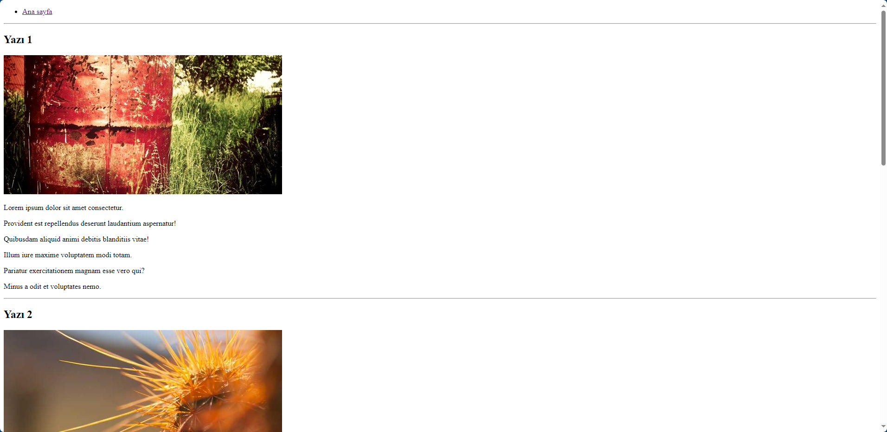

# Kodluyoruz Ilk Repo
Bu repo [kodluyoruz](https://academy.patika.dev/tr/courses/git) Front End eğitiminde oluşturduğumuz ilk repo. Içerisinde bir adet README dosyası ve bir adet index.html dosyası barındırıyor.



## Installation

Öncelikle projeyi clonelayın. (Buraya sizin reponuzdan aldığınız link gelecek)

```bash
git clone https://github.com/codingbrew/kodluyoruzilkrepo
```

## Usage

Projeyi cloneladıktan sonra Visual Studio Code programında açınız.

Linux için:
```linux
cd kodluyoruzilkrepo
code .
```

## Contributing
Pull requestler kabul edilir. Büyük değişiklikler için, lütfen önce neyi değiştirmek istediğinizi tartışmak için bir konu açınız.


## License
[MIT](https://choosealicense.com/licenses/mit/)